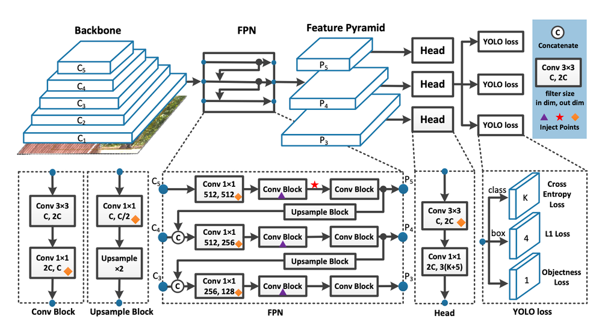

## How about this repo?

* Here is the repository for the algorithm of defect detection and segmentation with digital image processing with N.C.K.U. CSIE course.
* The project scope is Detection and Segmentation in the Powder Spreading Process of Magnetic Material Additive Manufacturing.
* If you want to know the UI, please refer to the following [link](https://github.com/NeroHin/defect-segment-detection-ui).

## What algorithm did we use?

#### YOLOv7

* The YOLOv7 algorithm is making big waves in the computer vision and machine learning communities. In this article, we will provide the basics of how YOLOv7 works and what makes it the best object detector algorithm available today. The newest YOLO algorithm surpasses all previous object detection models and YOLO versions in both speed and accuracy. It requires several times cheaper hardware than other neural networks and can be trained much faster on small datasets without any pre-trained weights.
* Read more at: https://viso.ai/deep-learning/yolov7-guide/



#### U-Net
* The architecture looks like a ‘U’ which justifies its name. This architecture consists of three sections: The contraction, The bottleneck, and the expansion section. The contraction section is made of many contraction blocks. Each block takes an input and applies two 3X3 convolution layers followed by a 2X2 max pooling. The number of kernels or feature maps after each block doubles so that architecture can learn the complex structures effectively. The bottommost layer mediates between the contraction layer and the expansion layer. It uses two 3X3 CNN layers followed by a 2X2 up convolution layer.

* 
* ref: [U-Net: Convolutional Networks for Biomedical Image Segmentation](https://towardsdatascience.com/u-net-b229b32b4a71)


### Result
  


### How to run?

1. install requirements
```bash
pip install -r requirements.txt
```

2. cd to the project directory
```bash
cd defect-segment-detection
```
